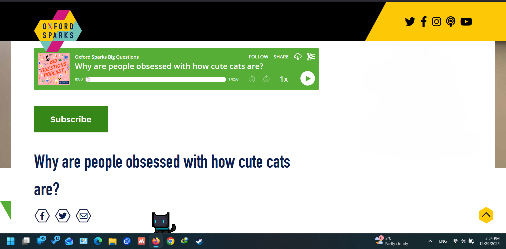

#  Nova: An Animated Browser Pet

 

Nova is a tiny, cute, and persistent pet that lives at the bottom of your browser window! It runs, idles, and follows a predictable, synchronized life across all your active tabs, thanks to a clever use of time-based seeded randomness.

This extension is built purely with HTML, CSS, and JavaScript as a Content Script, ensuring minimal performance impact.

##  Features

* **Persistent & Lively:** Nova runs around the bottom edge of your browser window on almost every page you visit.
* **Synchronized Behavior:** Using a time-sliced **Seeded Random Number Generator (PRNG)**, Nova performs the *exact same* actions (run, idle, turn) at the *exact same time* on every open tab/page. Say goodbye to unsynced pets!
* **Pixel Art Style:** Features a clean, scaled-up pixel art look, enhanced with `image-rendering: pixelated;` in the CSS for sharp edges.
* **Customizable:** Easily update the `animation_data.js` and the `sprites.png` file to change the pet, its animations, and its speed.

##  Installation (Developer Setup)

Nova is currently designed to be loaded directly into your browser as an unpacked extension.

### Firefox 

1.  Navigate to `about:debugging#/runtime/this-firefox`.
2.  Click the **"Load Temporary Add-on..."** button.
3.  Navigate to the directory where you cloned this repository and select the **`manifest.json`** file.
4.  Nova should now appear on your open tabs!

### Chrome/Edge/Brave 

1.  Navigate to `chrome://extensions` (or `edge://extensions`, `brave://extensions`).
2.  Enable **Developer Mode** using the toggle in the top-right corner.
3.  Click the **"Load unpacked"** button.
4.  Navigate to and select the directory where you cloned this repository.
5.  Nova should now appear on your open tabs!

> **Note:** For unpacked extensions, Nova will disappear when you close your browser. You will need to reload the extension via the respective "Load unpacked" or "Load Temporary Add-on" process if you restart your browser.

##  How It Works: The Synchronization Magic

The core innovation of Nova is its synchronized behavior across multiple tabs. This is achieved by:

1.  **Global Seed:** The function `getGlobalSeed()` generates a seed value based on the current time, rounded down to a 10-second interval (`TIME_SLICE_MS = 10000`).
    $$\text{Seed} = \lfloor \frac{\text{Date.now()}}{\text{TIME\_SLICE\_MS}} \rfloor$$
2.  **Decision Point Reseeding:** Every time the pet needs to make a new decision (`decideNextAction`), the PRNG is **reseeded** using this global, time-quantized seed.
3.  **Predictable Sequence:** Because the seed is identical in every tab at the same time, the subsequent calls to `seededRandom()` will produce the exact same sequence of "random" numbers. This means every pet on every tab will decide the exact same next action (e.g., "Run for 3.5s," "Turn Left," or "Idle for 2s") at the exact same moment.

##  Future Plans

* Add more interactive behaviors (following cursor, reacting to clicks).
* Create more diverse animations (jump, sleep, groom).
* Implement a simple settings page (Popup UI).

---

###  File Structure Overview

| File | Description |
| :--- | :--- |
| `manifest.json` | The required file defining the extension's name, version, icons, permissions, and which scripts/styles to inject. |
| `pet.css` | Styles the pet container (`#browser-pet-container`) and the sprite element (`#browser-pet-sprite`). |
| `animation_data.js` | Defines the animation frame data (sprite coordinates, frame size, speed) for all animations (`run`, `idle`). **The main customization file for new animations.** |
| `pet.js` | The core logic. Handles the PRNG, state machine (`decideNextAction`), animation setting, and position updates. |
| `sprites.png` | The sprite sheet containing all animation frames. |
| `icons/` | Contains the icons for the extension. |
